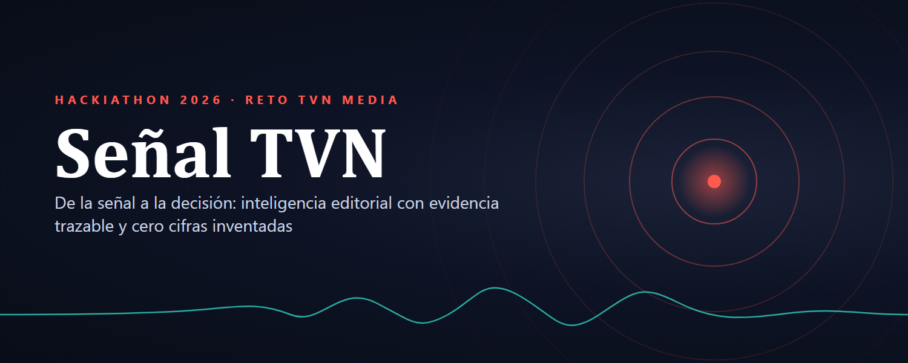
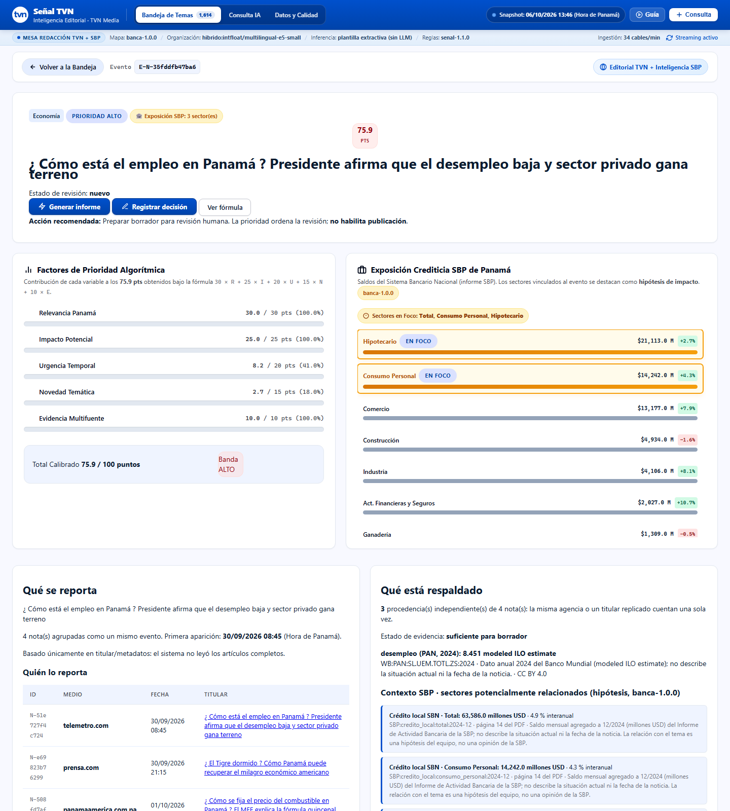
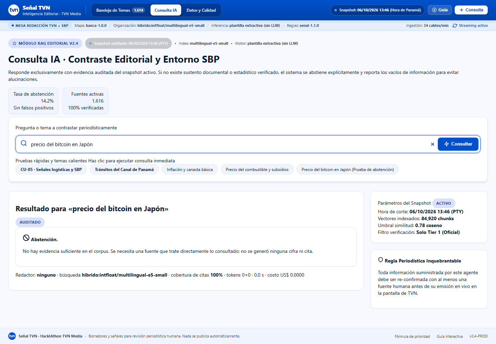
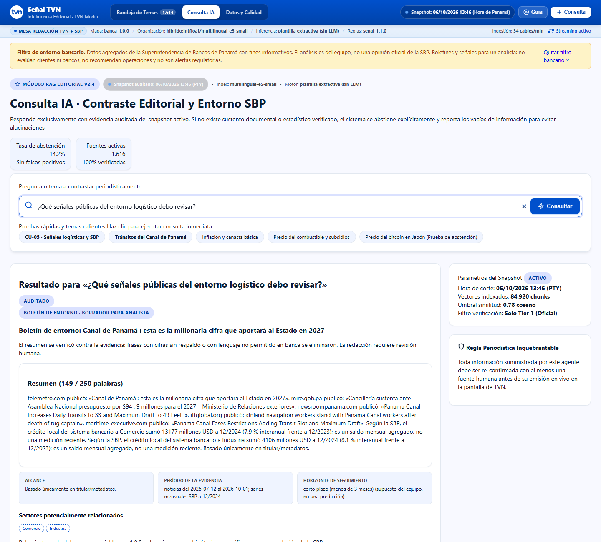
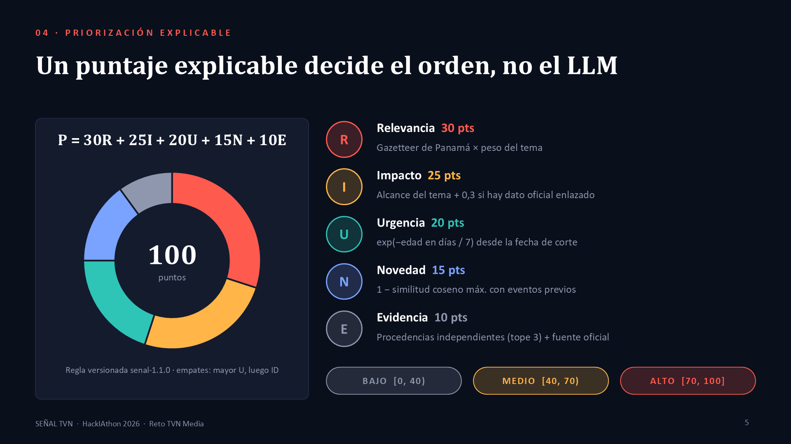

# Señal TVN &middot; Sistema de Inteligencia Editorial y Decisión



[](https://www.python.org/downloads/)
[](https://fastapi.tiangolo.com/)
[](app/tests)
[](docs/notion/01-plan-y-decisiones.md)

Solución integral para el **Reto TVN Media** del HackIAthon: un sistema de inteligencia editorial y análisis de señales que transforma cables noticiosos y datos públicos en **decisiones editoriales y bancarias trazables, verificadas y libres de alucinaciones**.

---

## 🚀 Inicio Rápido para Evaluadores

### Antes de la primera ejecución

1. **Python 3.12 o superior** (probado en 3.12 y 3.14).
2. **Ollama** con el modelo `llama3.2` para redactar borradores sin internet:
   ```bash
   ollama pull llama3.2
   ```
   Instalador: <https://ollama.com/download>. Ollama debe estar corriendo al iniciar la app.
   Si no responde, la app sigue funcionando y redacta con una plantilla extractiva (rotulada en la interfaz).
3. **Internet solo en la primera ejecución**: se descargan las dependencias y el modelo de
   embeddings `multilingual-e5-small`. Después la demo funciona **sin conexión** (T10).

El `.env` se crea desde `.env.example` con `SENAL_LLM=ollama`. Para usar Gemini, define `GEMINI_API_KEY` y `SENAL_LLM=gemini`.

### Arranque

El proyecto incluye ejecutables de arranque automático en la raíz que se encargan de configurar el entorno virtual, validar dependencias y levantar el servidor:

### Windows:
Doble clic en el archivo raíz:
```cmd
server_start.bat
```

### Linux / macOS:
```bash
chmod +x server_start.sh
./server_start.sh
```

> **URL de la Aplicación:** Una vez iniciado, abre tu navegador en:  
> 🔗 **[http://127.0.0.1:8765/](http://127.0.0.1:8765/)**

---

## 🖥️ Vista de la Aplicación

**Bandeja de temas:** 1.614 eventos agrupados y ordenados por un puntaje explicable.


**Ficha de evidencia:** desglose del puntaje, quién lo reporta, qué está respaldado y contexto oficial citado.



<table>
<tr>
<td width="50%"><b>Abstención:</b> sin evidencia en el corpus, no inventa cifras ni citas.<br></td>
<td width="50%"><b>Modalidad Banca (CU-05):</b> boletín de entorno con series SBP citadas.<br></td>
</tr>
</table>

**Priorización explicable:** el puntaje decide el orden, no el LLM.



---

## 🏛️ Estructura del Repositorio

El repositorio ha sido reorganizado y desacoplado para centrarse **100% en el Reto TVN Media**:

```text
HackIAthon_tvn/
├── server_start.bat       # Lanzador automático para Windows (raíz)
├── server_start.sh        # Lanzador automático para Linux/macOS (raíz)
├── .env.example           # Plantilla de variables de entorno (raíz)
├── .gitignore             # Ignora .env, .venv, cachés y temporales
├── README.md              # Documentación principal del reto
├── hackIAthon - reto TVN Media.pdf  # Términos y bases oficiales
├── hackIAthon_reto_TVN_Media.md     # Transcripción del reto
│
├── scripts/               # Scripts auxiliares y lanzador de servidor (raíz)
│   ├── server_start.py    # Preparación de .venv en raíz, dependencias y arranque
│   ├── build_snapshot.py  # Generador de snapshot procesado
│   └── extract.py         # Extracción de fuentes públicas
│
├── app/                   # Aplicación pura (FastAPI + Jinja + UI + Motor IA)
│   ├── src/senal/         # Núcleo: ingestión, clustering, scoring, citas, RAG, web
│   ├── data/              # Snapshot auditado: GDELT, Banco Mundial, USGS, INEC, SBP
│   ├── tests/             # 177 pruebas automatizadas (unitarias, web y contratos)
│   ├── evals/             # Benchmarks de triage y extensión bancaria
│   ├── pyproject.toml     # Especificación de proyecto Python moderno
│   └── requirements.txt   # Dependencias fijadas
│
├── docs/                  # Documentación ejecutiva y técnica
│   ├── notion/            # 8 páginas estructuradas + bitácora completa
│   │   ├── 00-inicio-del-reto.md
│   │   ├── 01-plan-y-decisiones.md
│   │   ├── 02-catalogo-de-datos.md
│   │   ├── 03-diseno-de-solucion.md
│   │   ├── 04-casos-y-evidencias.md
│   │   ├── 05-pruebas-y-metricas.md
│   │   ├── 06-riesgos-y-etica.md
│   │   ├── 07-presentacion-al-jurado.md
│   │   └── bitacora.md
│   └── adr/               # Registro de decisiones de arquitectura
│       ├── 0002-parte-2-senal-stack-y-reglas.md
│       └── 0003-parte-2-extension-bancaria.md
│
└── plans/                 # Planes de trabajo y ejecución detallada
    ├── parte-2-tvn-senal-a-decision.md
    └── parte-2-extension-bancaria.md
```

---

## 🎯 Dos Modalidades Operativas en la Misma Plataforma (ADR 0003)

La plataforma cuenta con un conmutador de modalidad en el header superior:

1. **Modalidad Editorial (TVN Media):**
   - **Bandeja de Temas:** Priorización multi-variable ($P = 30R + 25I + 20U + 15N + 10E$) sobre 1,614 eventos agrupados.
   - **Ficha del Tema:** Análisis en 4 dimensiones (*Qué se reporta*, *Quién lo reporta*, *Qué está respaldado*, *Qué falta*).
   - **Contraste contra Fuentes Oficiales:** Validación contra Banco Mundial, USGS, INEC y ACP.
   - **Borrador Periodístico con Citas:** Generación de textos con anclaje estricto de citas extractivas.
   - **Revisión Humana (*Human-in-the-loop*):** Flujo de aprobación editorial (*Listo para mesa*, *Requiere evidencia*, *Descartado*).

2. **Modalidad Banca (Extensión Sectorial):**
   - **Boletín de Entorno:** Síntesis ejecutiva de entorno macroeconómico para analistas bancarios.
   - **Series SBP Integradas:** Series históricas de la Superintendencia de Bancos de Panamá (crédito, liquidez, morosidad, activos).
   - **Aviso Ético Obligatorio:** Señales públicas de contexto que no emiten juicios sobre entidades financieras individuales ni calificaciones de riesgo crediticio.

---

## 🧪 Pruebas Automatizadas

Para validar los 177 tests de contratos, lógica, RAG y seguridad:

```bash
cd app
uv run pytest tests
# o usando pytest directamente en el entorno virtual activo:
pytest tests
```

**Resultado:**
- `177 passed` en menos de 10 segundos.
- Verificación exhaustiva de abstención ante alucinaciones, CSRF, validación de corte temporal, scoring y contratos de datos.

---

## 🛡️ Principios Éticos y Anti-Alucinación

- **El LLM no prioriza:** La prioridad de cobertura es calculada matemáticamente por la fórmula calibrada `senal-1.1.0`.
- **El LLM no inventa datos:** Si una consulta no encuentra evidencia en el snapshot auditado, el sistema responde explícitamente con **Abstención fundamentada**.
- **Trazabilidad:** Cada cifra y afirmación cuenta con su identificador de cable original o fuente oficial indexada.
